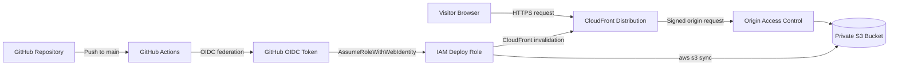
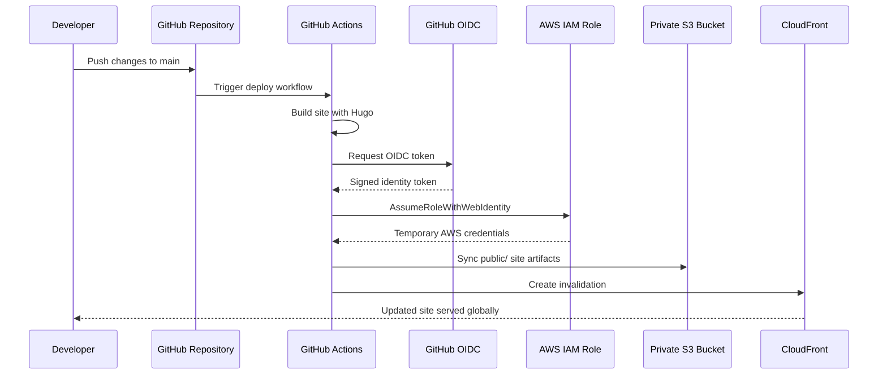

+++
title = "Architecture"
+++

This section documents how the site is built, deployed, and served in AWS.

## Overview

The site is a fully serverless static web platform:

- Hugo generates static HTML, CSS, and other assets.
- GitHub Actions builds the site on each push to `main`.
- GitHub authenticates to AWS using OIDC, not long-lived access keys.
- The generated site is uploaded to a private S3 bucket.
- CloudFront serves the content globally and accesses the bucket through Origin Access Control.

## High-Level Architecture

## Request Flow

When a visitor opens the site, CloudFront handles the request first. The distribution either serves the object from cache or requests it from the private S3 bucket using Origin Access Control. The bucket is not public, so objects are only reachable through CloudFront.

For clean Hugo URLs such as `/blog/` or `/resume/`, a CloudFront Function rewrites the request to the matching `index.html` object before the origin fetch.

## Deployment Sequence

## Security Model

- No static AWS credentials are stored in GitHub.
- The deploy workflow uses GitHub OIDC and temporary credentials.
- The IAM trust policy restricts assumption to this repository and branch.
- The IAM permissions policy only allows:
  - listing the target bucket
  - reading, writing, and deleting objects in that bucket
  - creating invalidations for the target CloudFront distribution
- The S3 bucket is private and blocked from public access.
- CloudFront is the only allowed reader of site objects through the bucket policy.

## Main AWS Components

### S3

The S3 bucket stores the generated site output from Hugo. It is versioned, encrypted with SSE-S3, and configured with public access blocked.

### CloudFront

CloudFront provides global delivery, TLS termination, caching, and the clean-URL request rewrite. It is the public entry point to the site.

### IAM and OIDC

The deploy role is assumed from GitHub Actions through the AWS IAM OIDC provider for `token.actions.githubusercontent.com`. This avoids access keys and follows current AWS and GitHub best practices for CI/CD federation.

## Operational Notes

- `terraform apply` creates the infrastructure and outputs the values needed by GitHub Actions.
- GitHub repository variables provide the deploy workflow with the AWS region, deploy role ARN, bucket name, and CloudFront distribution ID.
- A deployment invalidates the CloudFront cache after upload so updated content becomes visible quickly.

## Future Extensions

- Add a custom domain with `domain_aliases` and an ACM certificate in `us-east-1`.
- Add Route 53 records for DNS management.
- Add preview deployments for pull requests.
- Add CloudFront response headers or WAF if the site later needs stricter edge controls.
